# 💱 환율 조회 & 실시간 채팅 서비스 💱

## **1.프로젝트 개요**
공공데이터 API를 활용해 **전 세계 환율 정보를 손쉽게 확인**하고,  
**실시간 채팅(WebSocket)** 을 통해 사용자 간 소통이 가능한 웹 서비스입니다. 💬

---

## **2.개발 동기**
일본 여행을 준비하면서, 급격하게 변동되는 환율을 매번 직접 검색하는 것이 번거롭다고 느꼈습니다.  
특히 엔화처럼 자주 변하는 환율을 **한눈에 확인**하고 싶었고,  
이를 계기로 환율 조회 사이트를 직접 개발하게 되었습니다.

또한 단순한 정보 제공에서 끝나지 않고,  
**다른 사용자들과 여행 정보나 환율 팁을 공유할 수 있는 공간**을 만들고자  
WebSocket 기반의 실시간 채팅 기능을 추가했습니다.  
로그인을 통해 닉네임을 부여하여 최소한의 커뮤니티 형태도 갖추었습니다.

---

- ## **3.주요 기능**

| 기능 | 설명 |
|------|------|
| 🔍 환율 조회 | 한국수출입은행 OpenAPI를 이용한 최신 환율 정보 제공 |
| 📅 하루 평균 환율 | 날짜별 평균 환율 정보 DB 저장 및 조회 |
| 💬 실시간 채팅 | WebSocket 기반 사용자 간 실시간 메시지 |
| 🔐 로그인/Nickname | 채팅 입장 전 닉네임 등록 및 인증 |
| 🗄 DB 연동 | 수집된 환율 데이터 자동 저장 (MySQL) |

---
[//]: # (![img.png]&#40;img.png&#41;)

[//]: # (![Main.gif]&#40;screen%2FMain.gif&#41;)

[//]: # ()


[//]: # (![img_1.png]&#40;img_1.png&#41;)

[//]: # (![chart.gif]&#40;screen%2Fchart.gif&#41;)

[//]: # ()


[//]: # (![img_5.png]&#40;img_5.png&#41;)

[//]: # (![Cal.gif]&#40;screen%2FCal.gif&#41;)

[//]: # (로그인)

[//]: # (![img_2.png]&#40;img_2.png&#41;)

[//]: # (![Login.gif]&#40;screen%2FLogin.gif&#41; 실패 시 ![login2.gif]&#40;screen%2Flogin2.gif&#41;)

[//]: # ()


[//]: # (![img_3.png]&#40;img_3.png&#41;)

[//]: # (![chat.gif]&#40;screen%2Fchat.gif&#41;)

[//]: # (![chat2.gif]&#40;screen%2Fchat2.gif&#41;)

[//]: # ()


[//]: # (![img_4.png]&#40;img_4.png&#41;)

[//]: # (![join &#40;3&#41;.gif]&#40;screen%2Fjoin%20%283%29.gif&#41;)

---

### **1. 메인 화면**

<p align="center">
  
  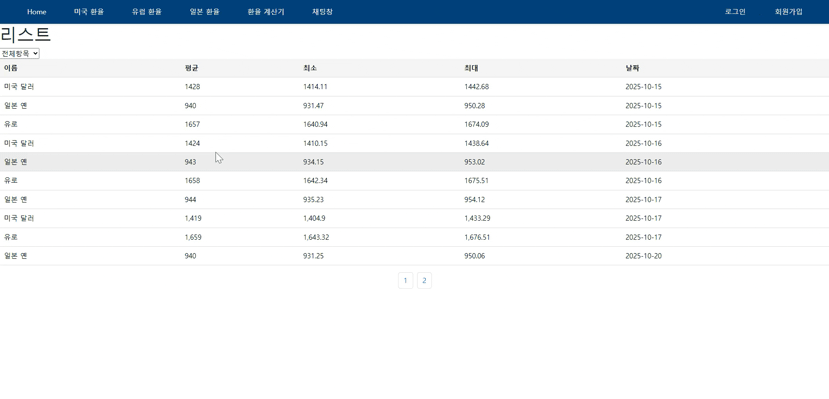
</p>

### 🔧 기술 설명
- 상단 네비게이션 영역에 Home, 미국/유럽/일본 환율, 환율 계산기, 채팅 메뉴를 배치했습니다.
우측에는 로그인/회원가입 메뉴, 로그인 시 사용자명 + 로그아웃이 표시됩니다.
메뉴 이동 시 Link를 사용하여 **새로고침 없이 페이지 전환이 가능합니다.


- 메인 화면에서는 주말 제외, 오래된 순 → 최신 순으로 3종 환율 리스트(USD, JPY, EUR)를 확인할 수 있습니다.
한 화면에 10개의 데이터가 표시되며, **페이지네이션(Pagination)**으로 리스트를 탐색할 수 있습니다.
셀렉트 박스를 통해 원하는 통화만 필터링하여 조회할 수 있습니다.
    ```javascript
    <option value={`${SERVER_HOST}/change/list`}>전체항목</option>
    <option value={`${SERVER_HOST}/change/usd`}>미국 환율</option>
    <option value={`${SERVER_HOST}/change/eur`}>유럽 환율</option>
    <option value={`${SERVER_HOST}/change/jpy(100)`}>일본 환율</option>

- 공공데이터 API를 활용해 환율 정보를 수집하고,
  UriComponentsBuilder로 API 엔드포인트 및 파라미터를 동적으로 구성한 뒤
  RestTemplate 을 통해 외부 API를 호출하여 JSON 데이터를 서버에서 가져옵니다.
  가져온 데이터는 파싱 후 DB에 저장되며,
  프론트에서는 비동기 요청(Axios) 으로 저장된 데이터를 조회하여 화면에 표시하도록 구현했습니다.

  ```java
  String uri = UriComponentsBuilder.fromHttpUrl(url)
  .queryParam("authkey", "키값")  // API 키값 서식
    .queryParam("searchdate","")
    .queryParam("data", "AP01")
    .toUriString();     

   List<ExChange> exchangeData = filterExchangeData(jsonResponse);  // Json 데이터를 배열로 만듬
  changeRepository.saveAll(exchangeData); // 데이터 저장


### 💭 힘들었던 점
- 외부 API를 직접 호출하면 속도/요청제한 문제가 발생할 수 있어
  서버에서 데이터를 수집 후 DB에 저장하는 방식으로 설계했습니다.
  프론트는 저장된 데이터를 비동기로 가져오도록 구현하며
  API 호출 시점과 상태 관리에 대해 깊게 학습했습니다.
    
---

### **2. 환율 그래프**

<p align="center">
  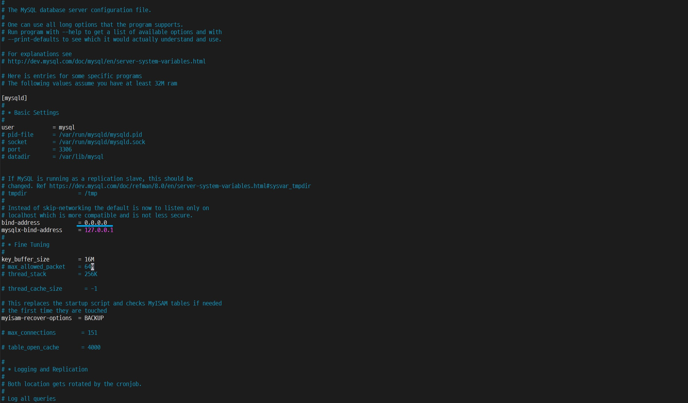
  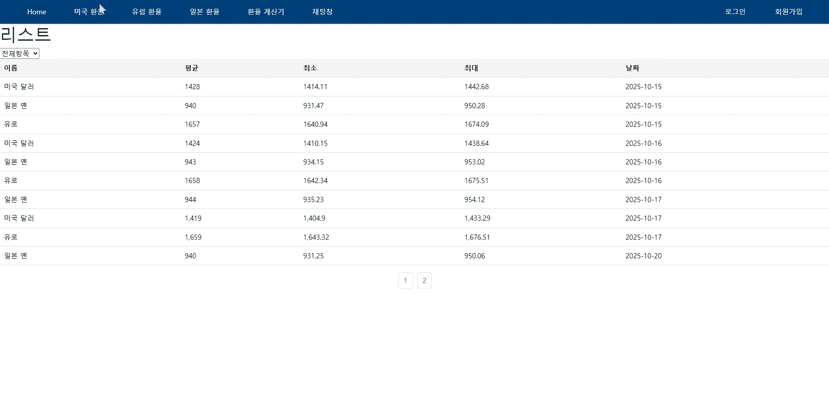
</p>

### 🔧 기술 설명
- 사용자가 최근 일주일간 데이터를 보기 편하게 Recahrts를 사용해 보기 편하게 구현하였습니다.
  최근 일주일 데이터만 유지되며
  새로운 데이터가 추가되면 가장 오래된 데이터를 제거하여, 항상 최근 일주일 데이터만 시각화되도록 설계했습니다..
 ```javascript
    while (updatedData.length > 7) {
    updatedData.shift();
        }
  ```

### 💭 힘들었던 점
- 날짜 문자열 데이터를 기준으로 정렬하고,
  차트 라이브러리에서 사용할 수 있도록 숫자 타입으로 변환하는 과정이 까다로웠습니다.
  특히 최근 7일 데이터만 유지하도록 가공 로직을 구현하면서 데이터 흐름을 깊이 이해하게 되었습니다.

---

### **3. 환율 계산기**

<p align="center">
  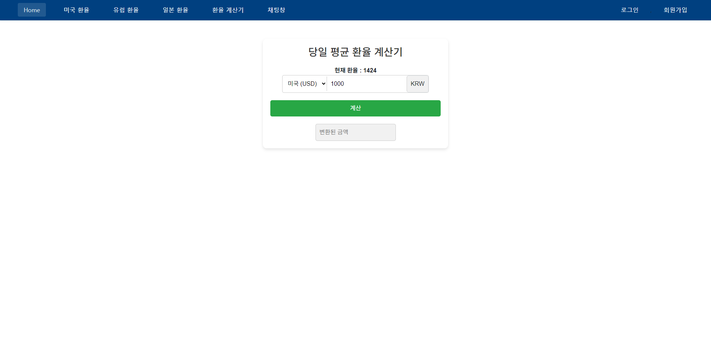
  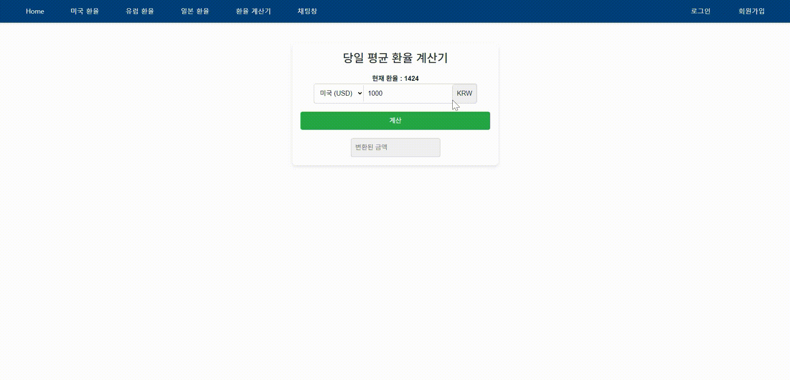
</p>

### 🔧 기술 설명
- 가장 최근 미국, 유럽, 일본 환율을 원화로 계산 할 수 있는 환율 계산기 입니다.
  최근 환율 데이터를 서버내에서 가져와, 최신 데이터를 반영했고
  원화 / 해당 국가 환율로 계산 후 결과 값을 나타내게 구현했습니다.
  

### 💭 힘들었던 점
- 환율 데이터가 문자열 형태로 전달되어 숫자 타입으로 변환하는 과정이 필요했습니다.

- 단순 변환이 아니라, 언제·어디서 변환하는 것이 적절한지 데이터 흐름을 설계하는 부분에서 고민이 많았습니다.

- 특히 통화 변경 시마다 최신 환율을 다시 가져와 계산에 반영하는 구조를 설계하며
  비동기 데이터 처리 흐름에 대한 이해가 더욱 필요하다고 느꼈습니다.
---

### **4.로그인**

<p align="center">
  
  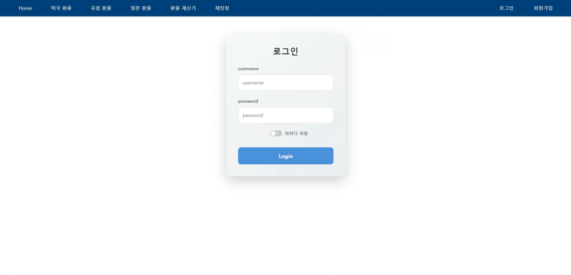
</p>

<p align="center">
  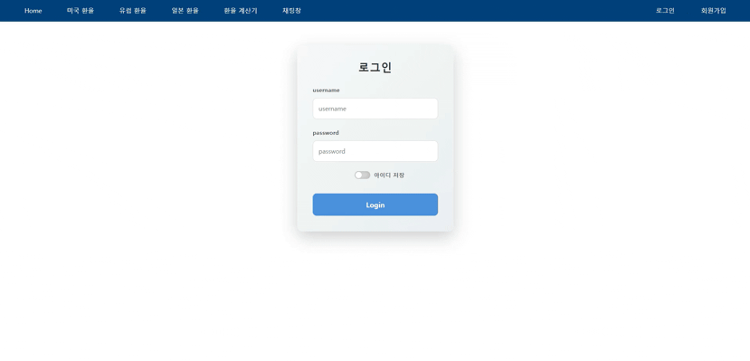
</p>

### 🔧 기술 설명
- 

### 💭 힘들었던 점
- 

---

### **5. 실시간 채팅**

<p align="center">
  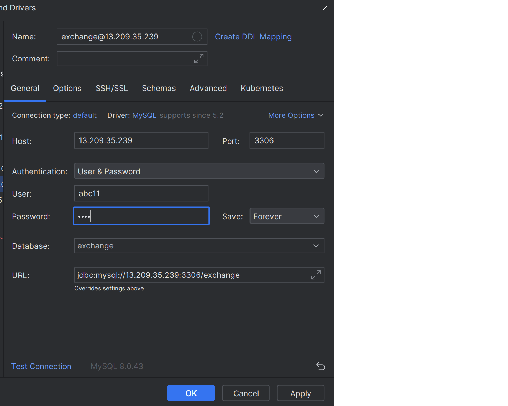
  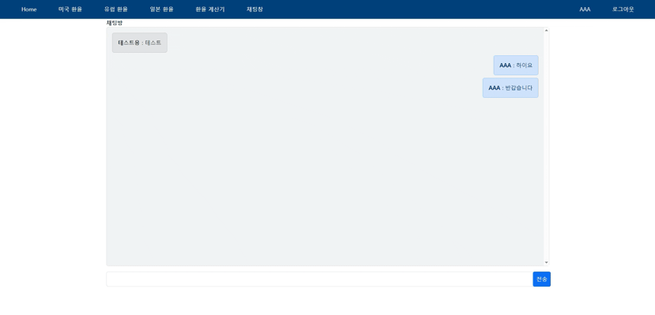
</p>

<p align="center">
  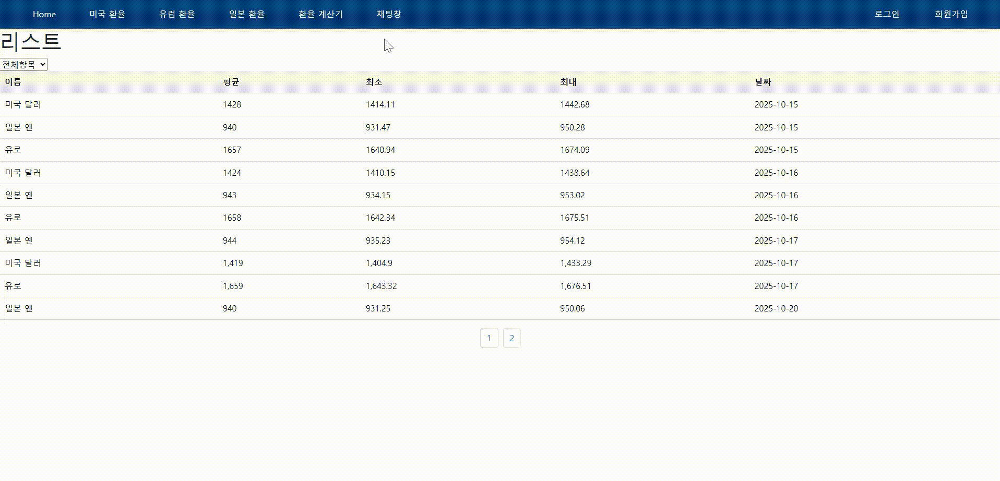
</p>

### 🔧 기술 설명
- 

### 💭 힘들었던 점
- 

---

### **6.회원가입**

<p align="center">
  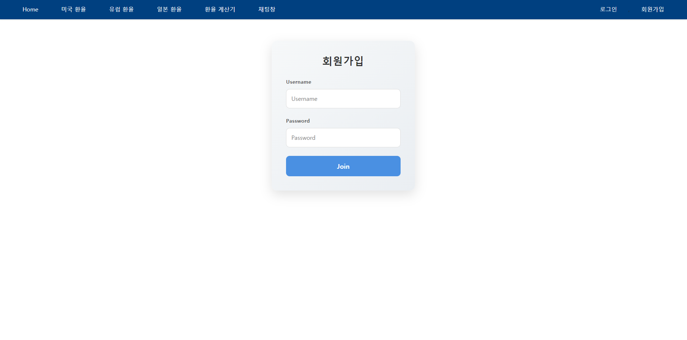
  
</p>

### 🔧 기술 설명
- 

### 💭 힘들었던 점
- 

---

MobaXterm, InteliJ MySQL 연결

## 🐧 MySQL 설치 (Ubuntu)

```bash
sudo apt update
sudo apt install mysql-server -y
sudo systemctl status mysql
```

## 🗝 MySQL 외부 접속 허용 설정 (AWS EC2)

AWS EC2에 설치된 MySQL에 외부에서 접속(DBeaver, Workbench 등)하기 위해서는 아래 설정이 필요합니다.

### **1.MySQL 설정 파일 수정**
```bash
sudo vi /etc/mysql/mysql.conf.d/mysqld.cnf
```

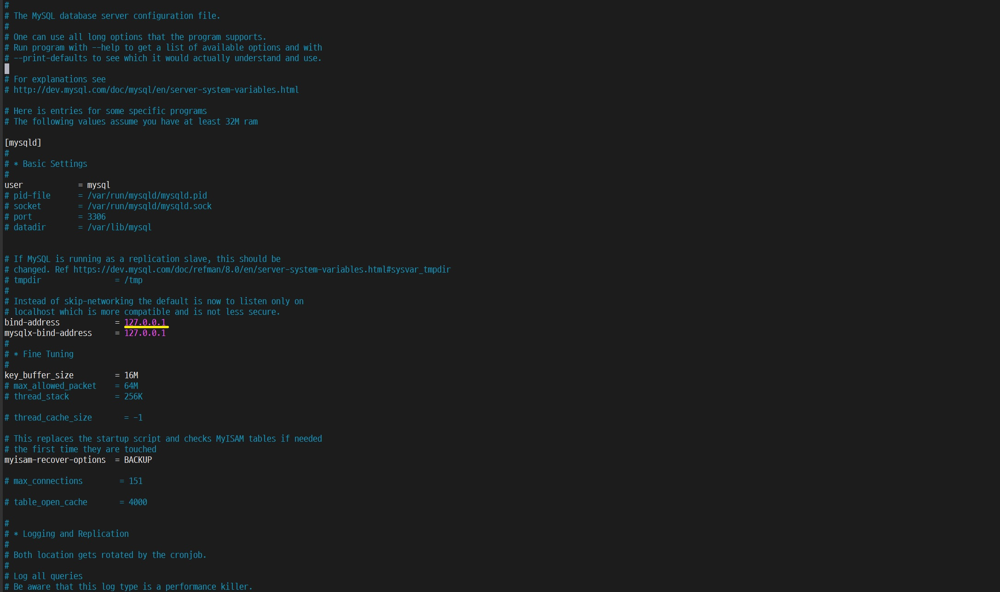
`bind-address` 값을 127.0.0.1 → 0.0.0.0 으로 변경


```
bind-address = 0.0.0.0
:wq     # 저장 후 종료
```

### **2.MySQL 재시작**
```bash
sudo systemctl restart mysql
```

### **3.root 계정 외부 접속 허용**
### 👤 MySQL 전용 계정 생성 및 권한 부여

운영과 보안을 위해 root 계정이 아닌, 별도 사용자 계정을 생성하여  
Spring Boot 애플리케이션에서 사용할 DB 계정을 분리했습니다.

```sql
-- 계정 생성
CREATE USER 'abc11'@'%' IDENTIFIED BY '1234';

-- 모든 DB에 대한 권한 부여 (CRUD 가능)
GRANT ALL PRIVILEGES ON *.* TO 'abc11'@'%';

-- 권한 적용
FLUSH PRIVILEGES;
```

이제 인텔리제이 실행 후 SQL 연결

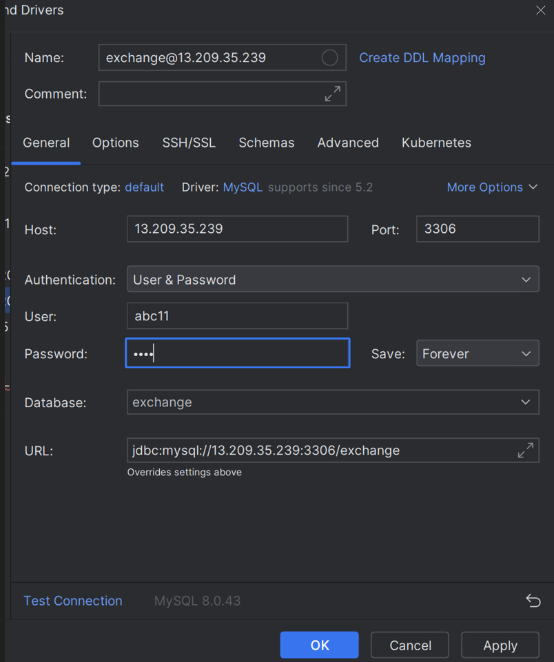
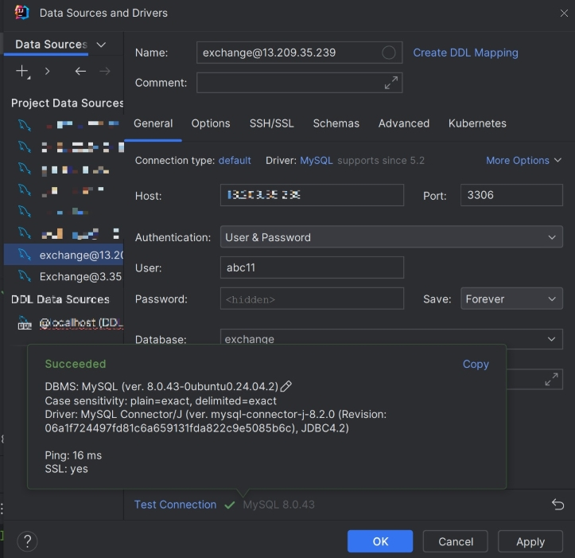!

연결 성공

해당 계정은 IntelliJ (Spring Boot)에서 데이터베이스 연결 및  
JPA 기반 삽입/수정/삭제에 사용됩니다.


---

## 🧠 느낀 점 / 회고

>  
>

- 비동기 통신과 WebSocket의 차이를 명확히 이해하게 되었음
- AWS EC2 서버 구축 및 DB 연결 과정에서 배포 구조를 깊게 학습함
- React + Spring Boot 연동 시 발생하는 CORS 문제를 직접 해결하며 백엔드 이해도 향상
- 실시간 데이터 반영 로직 설계의 중요성을 느낌

---


## ⚙️ 기술 스택

| **Front-End** | **Back-End** | **Infra / Tool** | **Version Control** |
|----------------|---------------|------------------|----------------------|
|  |  |  |  |
|  |  |  |  |
|  |  |  |  |
|  |  |  |  |
|  |  |  |  |
|  |  |  |  |
|  |  |  |  |

---

## 🌍 링크
- 🔗 **공공데이터 API:** [한국수출입은행 환율 API](https://www.koreaexim.go.kr/site/program/financial/exchangeJSON)
- 🧠 **프로젝트 이름:** `AwsExchange`


